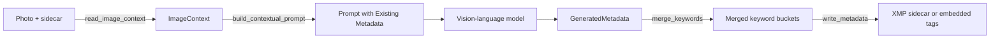

# Metadata and keywords

photo-tagger reads whatever metadata a photo already carries, feeds the useful parts into the model
prompt, and writes the result back as Lightroom-compatible tags. Two modules do this work:
[`metadata.py`](https://github.com/jbsilva/photo-tagger/blob/main/src/photo_tagger/metadata.py)
talks to ExifTool, and
[`keywords.py`](https://github.com/jbsilva/photo-tagger/blob/main/src/photo_tagger/keywords.py)
parses and merges hierarchical keywords. This page explains the round trip from read to write.

## Reading existing metadata

Before the model ever sees a photo, `read_image_context()` collects every read-only tag the pipeline
needs in a single `exiftool` call. Issuing one batched read instead of separate reads for keywords,
location, GPS, and camera EXIF keeps the per-photo IPC cost to one round trip. It returns an
`ImageContext`:

```python
@dataclass(slots=True, frozen=True)
class ImageContext:
    existing_keywords: KeywordSet  # typed subject / hierarchical / weighted views
    existing_title: str | None  # what --preserve-title would keep
    existing_description: str | None  # what --preserve-description would keep
    location_tags: dict[str, str]  # city/country from XMP-photoshop and IPTC
    gps_position: str | None  # Composite:GPSPosition, if present
    camera_info: dict[str, str]  # EXIF Model, LensModel, DateTimeOriginal
```

`KeywordSet` (in [`models.py`][models]) is a small dataclass with `subject`, `hierarchical`, and
`weighted` list fields. It replaced a bare `dict[str, list[str]]` keyed by those strings, so a
misspelled key is now a type error instead of a silently empty list.

The read targets both the image file and any adjacent `.xmp` sidecar, so metadata that lives only in
the sidecar is still picked up. Keywords from both are pooled; for the single-valued title and
description, the sidecar's answer wins (`_sidecar_first`). The sidecar is the later copy, the one
every XMP-aware catalog reads and the only thing a sidecar-mode run writes, so reading the image
first let a camera's placeholder shadow the caption photo-tagger had just written beside it.

`build_contextual_prompt()` turns that context into a short "Existing Metadata" block appended to
the user prompt. The model gets the first few existing keywords, a `City, Country` location hint,
the GPS position, and the camera, lens, and capture date. Camera details are corroborative only: the
prompt instructs the model to use them to disambiguate what is visible, never to assert content the
image does not show.



## Hierarchical keywords

The model returns taxonomy chains in a dedicated `hierarchies` field, leaf-first and joined with
`<`, for example `Duck<Bird<Animal`. `analyze_image_with_ai()` folds those chains into the keyword
list, so from here on a hierarchical keyword is just a keyword that contains `<`. Lightroom expects
the inverse of that leaf-first form: a root-to-leaf path joined with pipes, `Animal|Bird|Duck`.
`parse_hierarchical_keyword()` does the conversion and also returns each level as a flat keyword:

```python
parse_hierarchical_keyword("Duck<Bird<Animal")
# ('Animal|Bird|Duck', ['Animal', 'Bird', 'Duck'])
parse_hierarchical_keyword("Landscape")
# ('Landscape', ['Landscape'])
```

A plain keyword with no `<` separator passes through unchanged as a single-level entry. Stray `>`
characters the model sometimes emits are dropped before parsing.

### Merging with existing tags

`merge_keywords()` combines the new AI keywords with whatever already lives on the photo. It keeps
three parallel buckets and preserves the hierarchy:

- `subject`: every level flattened into a single keyword list.
- `hierarchical`: cumulative pipe paths. Lightroom needs each prefix, so a `Animal|Bird|Duck` leaf
    also contributes `Animal|Bird`.
- `weighted`: a flat list that mirrors `subject`.

Deduplication is case-insensitive (compared with `casefold`), so a photo that already carries `Bird`
will not gain a second `bird`. The first-seen casing wins. When a leaf appears in more than one
chain, the longest observed chain is kept.

Two flag pairs control the merge:

- `--preserve-keywords` (default) merges new keywords with the existing ones. `--overwrite-keywords`
    replaces them instead.
- `--max-keywords N` caps how many AI-generated keywords are kept per photo before merging. The
    default keeps all of them.

The title and the description hold a single value each, so they have no merge step: their pairs
(`--preserve-title` / `--overwrite-title` and `--preserve-description` / `--overwrite-description`)
only decide whether the generated text replaces what the photo carries, and each field answers for
itself. Replacing is the default, so a camera-written placeholder (some fill `ImageDescription` with
one on every photo) does not outlive the first run. Preserving writes the generated text only where
the field is empty, which is how a hand-written caption survives a re-run.

!!! example

    Existing `Animal|Bird` plus the model output `Seagull<Bird<Animal` and `bird` merges to a
    `hierarchical` bucket of `['Animal|Bird', 'Animal|Bird|Seagull']`: the duplicate `Bird` is collapsed
    and the deeper chain is added.

## Writing metadata

`write_metadata()` builds one ExifTool payload and applies it in a single `set_tags` call. Each
piece of generated metadata is written to both an XMP tag and its IPTC or EXIF counterpart so that
different tools agree on the value. Lightroom prioritizes `IPTC:Keywords` for JPEGs, which is why
the flat subject list is mirrored there.

| Generated field    | Tags written                                                                 |
| ------------------ | ---------------------------------------------------------------------------- |
| Flat keywords      | `XMP-dc:Subject`, `IPTC:Keywords`                                            |
| Keyword hierarchy  | `XMP-lr:HierarchicalSubject`                                                 |
| Weighted flat list | `XMP-lr:WeightedFlatSubject`                                                 |
| Title              | `XMP-dc:Title`, `IPTC:ObjectName`                                            |
| Description        | `XMP-dc:Description`, `XMP-tiff:ImageDescription`, `EXIF:ImageDescription`\* |

\* `EXIF:ImageDescription` only when the target is the photo itself: a sidecar holds XMP and nothing
else. ExifTool maps the `XMP-tiff` mirror back to IFD0 when a sidecar is folded into an image, but a
direct write does not touch IFD0, so writing the EXIF tag too is what keeps a camera's placeholder
from surviving underneath the new description.

Title and description are only written when `--write-title` and `--write-description` are enabled
(both are on by default). If the payload would be empty, nothing is written.

### Sidecar or embedded

By default photo-tagger writes an XMP sidecar named after the image (`image.cr3` gets `image.xmp`).
This leaves the original file byte-for-byte untouched. `--sidecar-mode` picks between the three
answers; `--write-sidecar` and `--embed-in-photo` are shorthand for the first two.

=== "Sidecar (default, `--sidecar-mode all`)"

    ```text
    photos/
      duck.cr3        # original, never modified
      duck.xmp        # title, description, and keywords
    ```

=== "Embedded (`--embed-in-photo`)"

    ```text
    photos/
      duck.cr3        # metadata written into the file itself
    ```

=== "One of each (`--sidecar-mode raw`)"

    ```text
    photos/
      duck.dng        # RAW: original, never modified
      duck.xmp        # its title, description, and keywords
      duck.jpg        # not RAW: metadata written into the file itself
    ```

!!! note

    Sidecars keep your originals completely untouched, and Lightroom reads the `.xmp` file alongside the
    photo on import. This is the safest option for RAW workflows, which is why it is the default.

`--sidecar-mode raw` is for the folder that holds both, the RAW+JPEG pairs a camera set to that mode
produces: the RAWs keep their bytes, and each JPEG carries its own metadata so it travels intact.
RAW is decided by extension, by exclusion: a suffix Pillow reads natively (`.jpg`, `.png`, `.tif`,
`.heic`, ...) is not RAW, and anything else is, so an unfamiliar extension gets the cautious answer
and keeps its file untouched.

### Cameras ExifTool will not write to on the first try

ExifTool refuses a write when it cannot parse a photo's maker notes: it will not move a block whose
internal offsets it cannot fix up. Some cameras ship files that trip this, their maker-note offsets
already wrong from the camera (`exiftool -validate` says so before anything has written to them), so
every embedded write failed with `Error: [minor] Maker notes could not be parsed`.

Such a write is tried once more with ExifTool's `-m` (ignore minor errors), the only way to put
metadata inside those files, and each retry is logged per photo. The waiver is never asked for up
front, since the check is worth having for everything else. Maker notes and image data come through
byte-identical; what stays wrong is what the camera already had wrong.

### Backups and dry runs

When writing, ExifTool keeps a `*_original` backup of the target before changing it. This is on by
default. `--no-backup-xmp` passes `-overwrite_original` to ExifTool so no backup file is left
behind. The GUI exposes the same choice as **Keep ExifTool Backup** in the Save options menu.

`--dry-run` runs the model and logs the proposed title, description, and keywords, but writes
nothing. Use it to preview output before touching any files.

!!! warning

    `--no-backup-xmp` combined with `--embed-in-photo` modifies the original image file with no backup.
    Make sure you have your own copies before running that combination.

## Detecting tagged images

`find_tagged_images()` powers the `--skip-tagged` filter. It batches one ExifTool read across all
candidate files and marks a photo as already tagged when the image or its sidecar has any of the
indicator tags populated: the keyword tags above, a title, or a description. See
[Processing pipeline](pipeline.md) for where this filter runs in the batch.

## Related pages

- [Processing pipeline](pipeline.md): how the read, prompt, merge, and write steps are orchestrated
    per photo.
- [AI providers](ai-providers.md): how the prompt reaches the model and the structured output comes
    back.
- [CLI reference](../usage/cli-reference.md): the full list of output and filter flags referenced
    here.

[models]: https://github.com/jbsilva/photo-tagger/blob/main/src/photo_tagger/models.py
